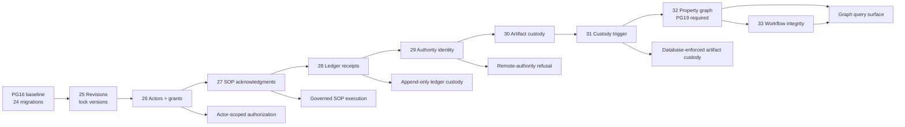
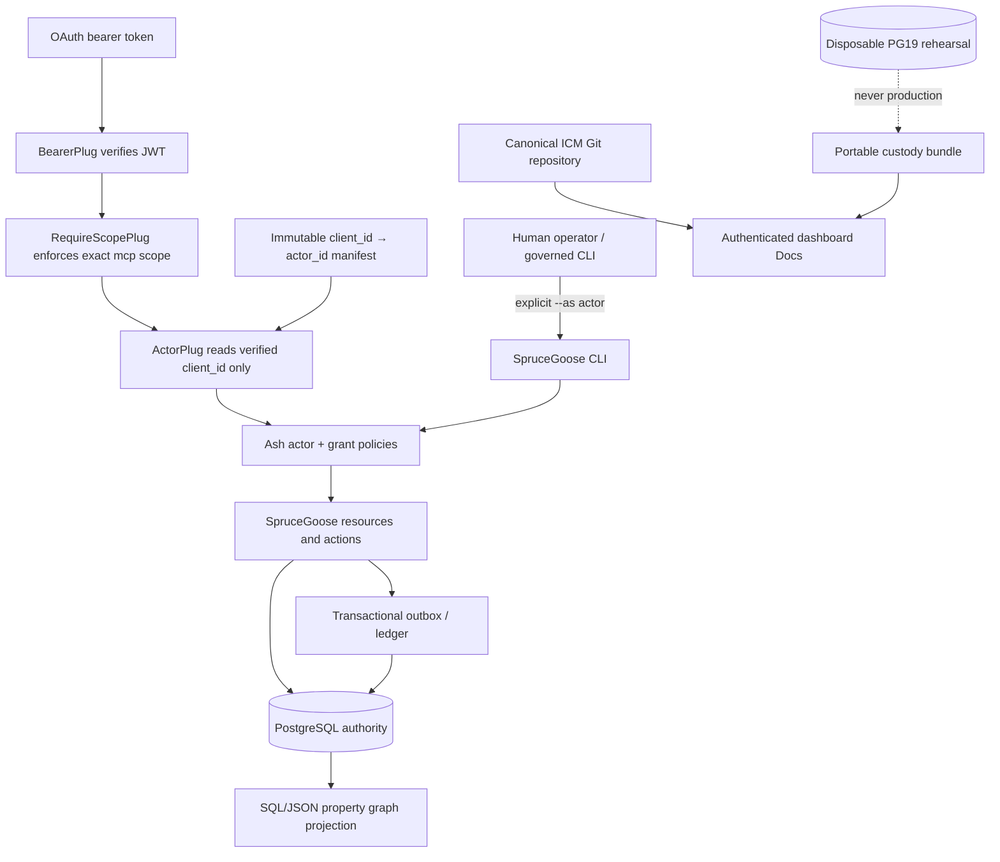
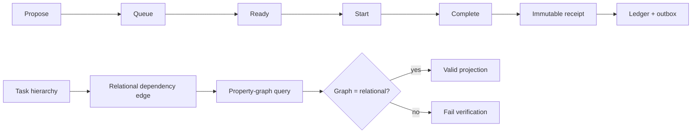
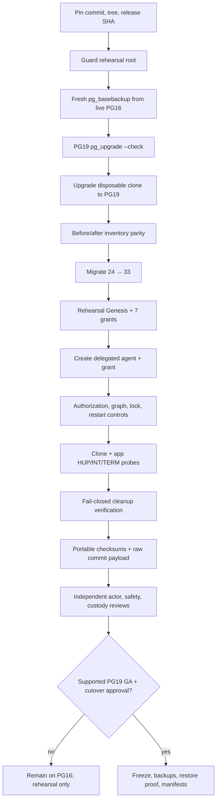
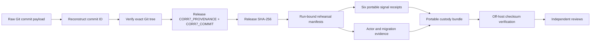
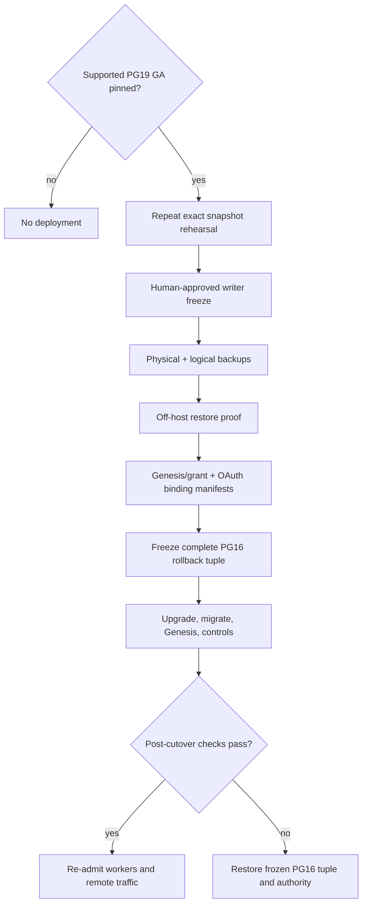

# SpruceGoose PostgreSQL 19 system additions

> **Status:** reconciled rehearsal baseline; **not production-authorized**. PostgreSQL 19 Beta 2 is evidence-only.
>
> **Exact source:** commit `8a2755509773be2bb2b0184f45ba7579c3db6d03`, tree `1219a96837ff1c904db9d60d002f38378a037fd1`.

This document explains the additions carried by the PostgreSQL 19 staging line, how they depend on one another, which authority boundaries they enforce, how the disposable Mama rehearsal works, and what remains before a production cutover.

## Reading map

| View | Purpose | Exported assets |
|---|---|---|
| System architecture | Components, trust boundaries, data/control flows | [SVG](/docs/assets/sprucegoose-system-architecture.svg) · [PNG](/docs/assets/sprucegoose-system-architecture.png) · [Excalidraw](/docs/assets/sprucegoose-system-architecture.excalidraw) |
| Migration DAG | Ordered 24→33 schema and feature dependency chain | [SVG](/docs/assets/sprucegoose-migration-dag.svg) · [PNG](/docs/assets/sprucegoose-migration-dag.png) · [Excalidraw](/docs/assets/sprucegoose-migration-dag.excalidraw) |
| Rehearsal workflow | Snapshot, upgrade, actor transition, cleanup, custody, review | [SVG](/docs/assets/sprucegoose-rehearsal-workflow.svg) · [PNG](/docs/assets/sprucegoose-rehearsal-workflow.png) · [Excalidraw](/docs/assets/sprucegoose-rehearsal-workflow.excalidraw) |
| Canonical ICM | Corr-8 reconciliation record and production boundary | [Open in dashboard](/docs/icm-corr8-reconciliation) |


## 1. What was added

The reconciled line integrates nine migrations and their required application behavior rather than extracting the PostgreSQL 19 property graph in isolation.

| Order | Migration | Addition | Operational dependency |
|---:|---|---|---|
| 25 | `20260805200255` | Revisions and lock versions | Establishes optimistic concurrency and revision lineage |
| 26 | `20260806033446` | Actor and grant registry | Requires an explicit Genesis transition before normal traffic resumes |
| 27 | `20260807031037` | Versioned SOP acknowledgments | Binds actors to exact governed procedure bytes |
| 28 | `20260810030458` | Immutable ledger import receipts | Adds append-only import custody; no generic rollback claim |
| 29 | `20260810034300` | Authority-instance identity | Makes remote-authority mismatch fail closed |
| 30 | `20260810121915` | Artifact custody requirements and receipts | Adds artifact identity and provenance controls |
| 31 | `20260810133000` | Artifact custody trigger hardening | Enforces custody invariants in PostgreSQL, not only application code |
| 32 | `20260810143000` | Task-dependency property graph | Requires PostgreSQL 19 `CREATE PROPERTY GRAPH` |
| 33 | `20260810170000` | Workflow metadata integrity | Prevents dependency metadata from drifting away from workflow truth |

Application features coupled to this sequence include scoped actor authorization, governed revisions, durable outbox and ledger controls, artifact custody, task-dependency graph queries, remote-authority refusal, and lifecycle-reason clearing.

## 2. Migration and feature dependency DAG




### Why the chain is indivisible

The graph migration consumes task/workflow truth whose authority, revision, custody, and lifecycle semantics are established by preceding migrations. Running migration 32 alone would create a query surface over data that lacks the actor and custody controls assumed by the reconciled application.

## 3. Runtime architecture and trust boundaries



### OAuth actor authority

1. `BearerPlug` validates the signed bearer token.
2. `RequireScopePlug` requires exact `mcp` scope before actor resolution.
3. `ActorPlug` reads only verified `oauth_claims["client_id"]`.
4. A configured immutable client-ID → actor-ID binding selects the actor.
5. Missing bindings, missing actors, disabled actors, spoofed connection assigns, user `sub`, and `client_name` metadata fail closed.
6. Ash policies enforce actor grants on the MCP read surface.

### Registry concurrency

Genesis and every actor/grant mutation run under the same PostgreSQL transaction-scoped advisory lock. Authority is re-read after lock acquisition, preventing a waiting stale administrator from mutating after concurrent revocation. Genesis actor creation plus the seven global grants is one transaction; notifications occur only after commit.

## 4. Data and lifecycle workflow



Workflow metadata is not an independent source of truth. Migration 33 prevents mutation that would allow dependency metadata to diverge from the governed workflow relationship.

## 5. Disposable snapshot rehearsal workflow




### Destructive-operation guard

Immediately before each recursive deletion, the canonical guard:

- canonicalizes candidate and live paths;
- rejects equality and either ancestor/descendant overlap;
- rejects every symlink component;
- rejects a mount point at or below the deletion root;
- rejects a different enclosing mount from the live path.

The guard is reapplied to evidence, work, release, and database roots; a prior check is not treated as durable permission for a later deletion.

### Cleanup state machine

All success, ordinary failure, and HUP/INT/TERM exits must prove:

- transient PostgreSQL inactive;
- transient application inactive;
- no surviving transient process or socket;
- live PostgreSQL active;
- live application active.

A unit still `activating`, `active`, or `deactivating`, a running clone, a stale socket, or an unhealthy live service changes the result to failure. Cleanup errors are never suppressed into a successful completion receipt.

## 6. Evidence and custody chain



### Reconciled rehearsal identity

| Item | Identity |
|---|---|
| Commit | `8a2755509773be2bb2b0184f45ba7579c3db6d03` |
| Tree | `1219a96837ff1c904db9d60d002f38378a037fd1` |
| Release SHA-256 | `c87c0e5ccc980b14757fe8ee07b0043f5c7f428b5d27f7679aa349068014da30` |
| Portable custody SHA-256 | `b5486d375cb1c80d035a1975ae81e88595994d048e1c274f3d9bb9f7b324db68` |
| ICM merge commit | `7cffbf67c13fdc0620e2cb3e8e44d7a80cbc3967` |
| Governed task | `tsk-20260811T181434Z-609b2191` |

Verified rehearsal results: migrations `24→33`, tasks `583→583`, relational/graph edges `57/57`, actors/grants `2/8`, clone and application HUP/INT/TERM statuses `129/130/143`, and cleanup PASS.

## 7. Production cutover and rollback workflow



Rollback is snapshot-based. Ledger receipt and authority-identity migrations do not promise generic `down/0`, and artifact custody intentionally refuses unsafe rollback after custody-bearing data exists.

## 8. Production blockers

The reconciled candidate is **not production-ready** until all are true:

- a supported PostgreSQL 19 GA artifact is pinned by exact checksums;
- the full rehearsal is rerun against that exact GA and exact application tree;
- a separate human-approved freeze and cutover task exists;
- every application, worker, outbox, bridge, and mutation writer is quiescent;
- frozen physical and logical backups are checksum-verified, transferred off-host, and restore-proven;
- production Genesis actor/grants and OAuth client bindings are approved and read back;
- the PG16 unit, binaries, data, release, environment, and authority tuple is frozen and restore-proven;
- post-cutover migration, authorization, graph, restart, custody, and worker-admission checks pass.

Until then Mama remains on PostgreSQL 16.14 at migration 24, and PostgreSQL 19 Beta 2 remains disposable evidence only.

## 9. Dashboard and ICM publication workflow

The dashboard does not copy or reinterpret the canonical ICM report. `/docs/icm-corr8-reconciliation` reads the allowlisted Markdown directly from `ICM_ROOT`, passes it through the existing escaped Markdown renderer, and remains behind dashboard authentication. Visual exports come from the separate governed docs artifact root. Arbitrary paths, unregistered files, traversal, and symlink escapes are rejected.

```mermaid
flowchart LR
  SG[SpruceGoose docs source] --> EXPORT[SVG / PNG / Excalidraw exports]
  EXPORT --> DOCROOT[Dashboard docs artifact root]
  ICMGIT[Canonical ICM Git] --> SYNC[ICM synchronized checkout]
  SYNC --> ICMROOT[ICM_ROOT]
  DOCROOT --> CATALOG[Fixed authenticated docs catalog]
  ICMROOT --> CATALOG
  CATALOG --> DASH[/docs library]
```

## 10. Operator verification checklist

- [ ] Verify dashboard source commit/tree and a clean isolated worktree.
- [ ] Verify visual export checksums after publication.
- [ ] Run the focused docs controller tests.
- [ ] Run the complete dashboard suite and warnings-as-errors compile.
- [ ] Build the production release from the reviewed tree.
- [ ] Health-check the candidate before any service switch.
- [ ] Verify `/docs`, system guide, ICM report, and all asset types through an authenticated browser.
- [ ] Confirm unauthenticated requests redirect to `/login`.
- [ ] Confirm the live SpruceGoose and PostgreSQL services were not changed by documentation publication.
